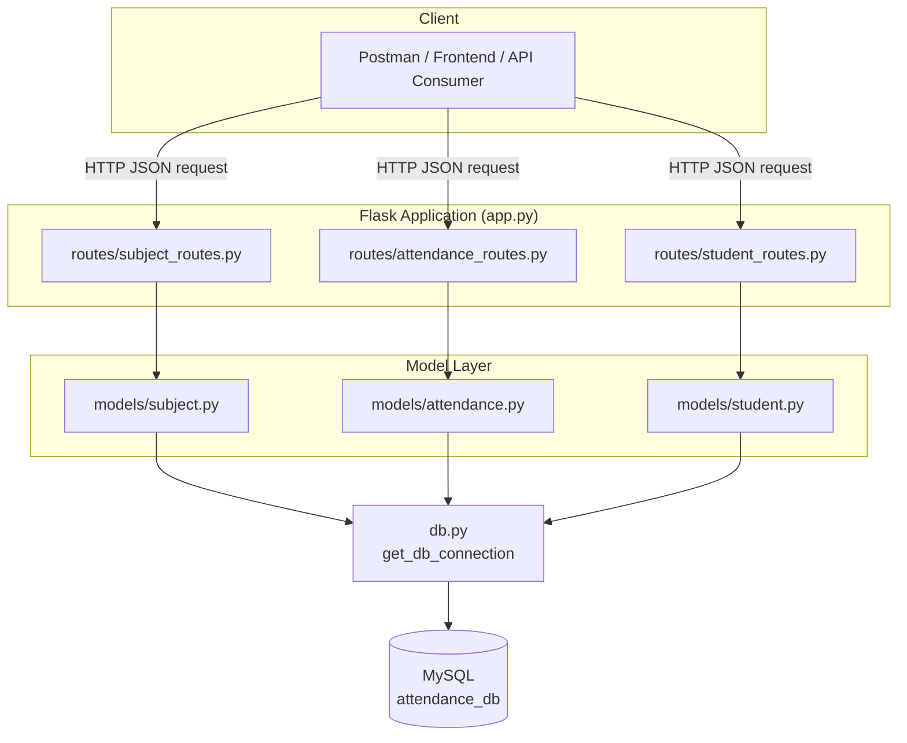

# System Architecture

The system follows a simple 3-tier backend architecture: of a Flask HTTP layer, a
model/data-access layer, and the MySQL database.

## Layers

| Layer | Responsibility | Files |
|---|---|---|
| Presentation / API | Parses HTTP requests, validates required fields, returns JSON + status codes | `app.py`, `routes/*.py` |
| Business / Data Access | Builds and executes SQL, applies business rules (e.g. duplicate-attendance prevention) | `models/*.py` |
| Connection | Opens a MySQL connection using credentials from  the environment variables | `db.py` |
| Storage | Persists subjects the attendance records  and students | MySQL (`attendance_db`) |

## Why this structure

  Blueprints per resource** (`subject_routes`, `attendance_routes`, `student_routes`) keep each
  resource's endpoints isolated and independently testable.
  Models own all SQL**, so that routes never talk to the database directly — this keeps validation
  (in routes) separate from persistence (in models).
 `db.py` is the single connection point**, so credentials and connection logic live in exactly
  one place and are read from  the environment variables rather than hardcoded.
