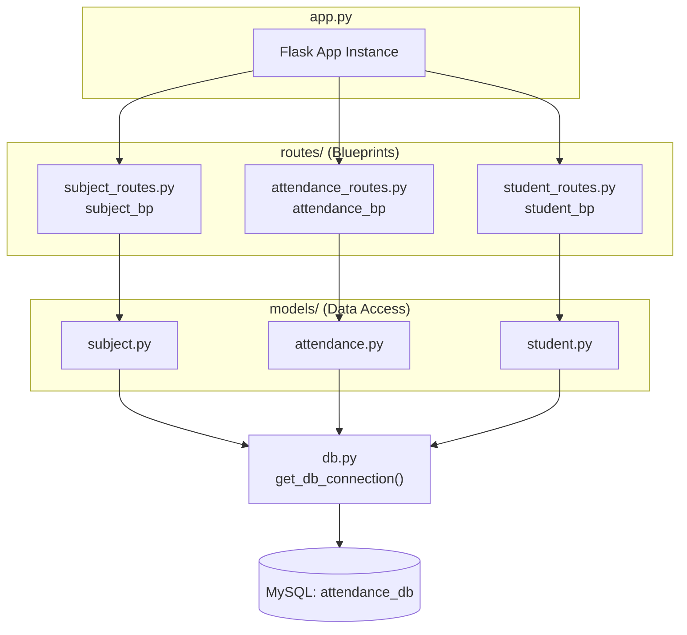

# Component Diagram

## Module responsibilities (functions exposed)

**`models/subject.py`**
- `create_subject(data)`
- `get_all_subjects()`
- `get_subject_by_id(subject_id)`
- `update_subject(subject_id, data)`
- `delete_subject(subject_id)`

**`models/attendance.py`**
- `mark_attendance(data)`
- `get_attendance_by_student(student_id)`
- `get_attendance_by_date(attendance_date)`
- `get_attendance_percentage_overall(student_id)`
- `get_attendance_percentage_subject(student_id, subject_id)`

**`models/student.py`**
- `create_student(data)`
- `get_all_students()`
- `get_student_by_id(student_id)`
- `update_student(student_id, data)`
- `delete_student(student_id)`
- `search_students(query)`

Each `routes/*.py` file defines a Flask `Blueprint` that maps HTTP verbs + URL paths to the
corresponding function in its matching `models/*.py` file, and is registered onto the main
`Flask` app in `app.py`.
