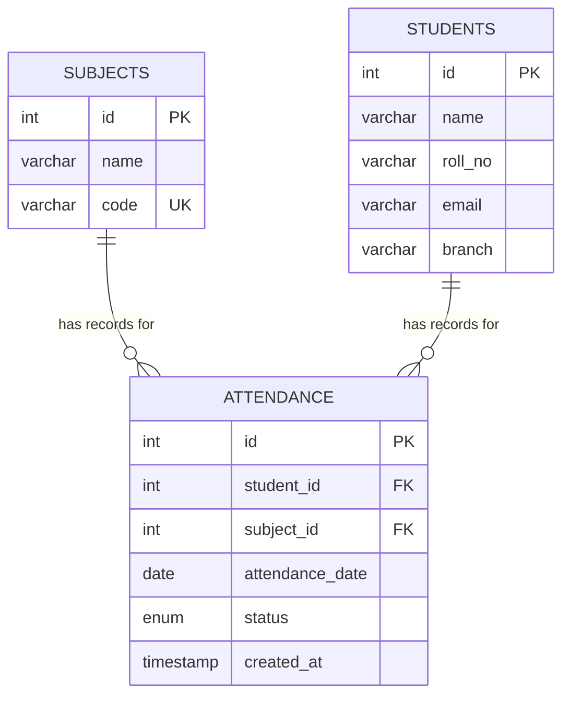

# ER Diagram



## Notes

- `ATTENDANCE.student_id` and `ATTENDANCE.subject_id` are currently plain integer columns
  (not enforced with a `FOREIGN KEY` constraint in the SQL in the README) — the relationship
  is logical, matching how the API uses `student_id`/`subject_id`. Adding explicit foreign-key
  constraints (`REFERENCES students(id)`, `REFERENCES subjects(id)`) is a recommended future
  enhancement (see `PROJECT_REPORT.md`).
- `UNIQUE(student_id, subject_id, attendance_date)` on `ATTENDANCE` is what prevents duplicate
  attendance entries for the same student/subject/day.
- The `students` table schema (used by `models/student.py`) should also be created:

```sql
CREATE TABLE students (
    id INT AUTO_INCREMENT PRIMARY KEY,
    name VARCHAR(100) NOT NULL,
    roll_no VARCHAR(50) NOT NULL UNIQUE,
    email VARCHAR(100) NOT NULL UNIQUE,
    branch VARCHAR(100) NOT NULL
);
```
