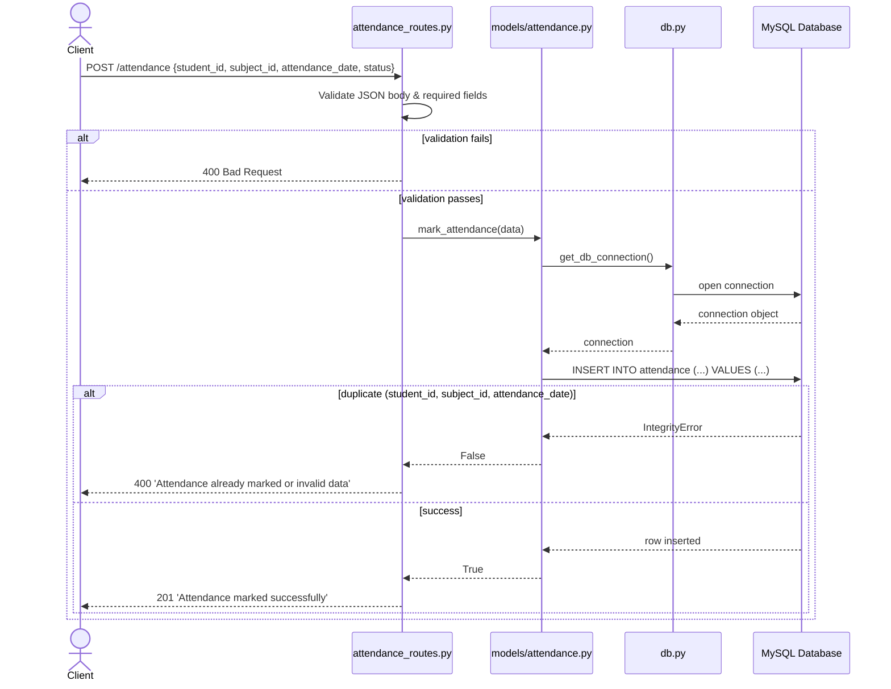

# Sequence Diagram — Mark Attendance



# Sequence Diagram — Attendance Percentage Lookup

```mermaid
sequenceDiagram
    actor Client
    participant Route as attendance_routes.py
    participant Model as models/attendance.py
    participant MySQL as MySQL Database

    Client->>Route: GET /attendance/percentage/student/{id}
    Route->>Model: get_attendance_percentage_overall(student_id)
    Model->>MySQL: SELECT status FROM attendance WHERE student_id = ?
    MySQL-->>Model: rows
    alt no rows
        Model-->>Route: None
        Route-->>Client: 404 'No attendance records found'
    else rows found
        Model->>Model: percentage = present_count / total_count * 100
        Model-->>Route: percentage
        Route-->>Client: 200 {student_id, attendance_percentage}
    end
SEQUENCE DIAGRAM

The sequence diagram shows how a request moves through the Attendance Management System API.

For example when the attendance is marked the flow is:

1. The client sends a POST request to the attendance endpoint.
2. The Flask route receives the request and reads the JSON data.
3. The route checks the required fields and verifies that the values are not empty.
4. The request is passed to the attendance model function.
5. The model checks the database for an existing attendance record.
6. If the record already exists the API returns a duplicate-entry response.
7. If no duplicate is found the model inserts the attendance record into MySQL.
8. The database returns the result of the operation.
9. Flask sends the final response back to the client.

Attendance percentage follows a slightly different flow. The client requests the attendance percentage, the route sends the required student or subject information to the model, and the model reads the attendance records from MySQL. The number of present records and total records are used to calculate the percentage which is then returned in the API response.

The main components involved are:

Client → Flask Route → Model Function → MySQL Database → Model Function → Flask Route → Client

This sequence represents the actual separation used in the project between API routes, database-related functions, and the MySQL database.

