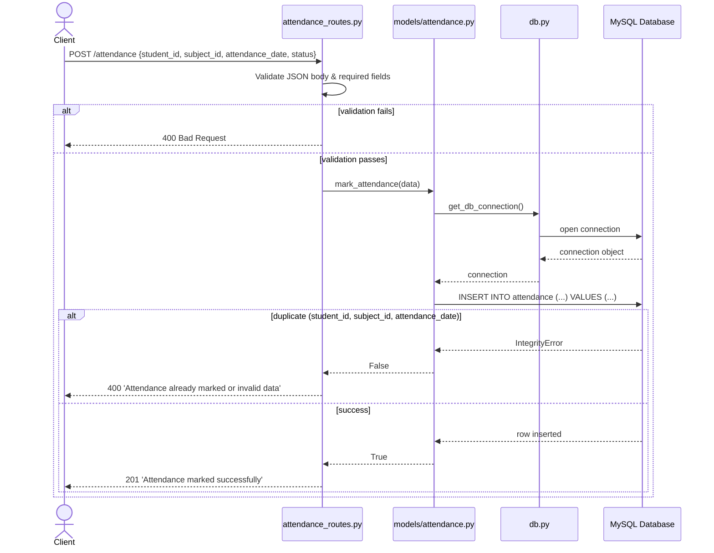
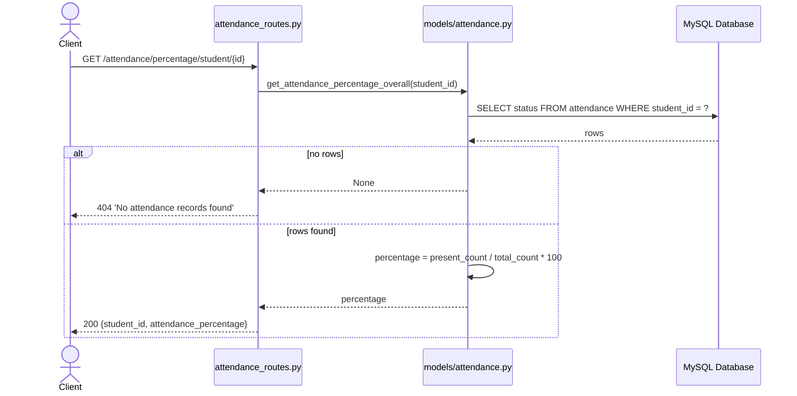

# Sequence Diagram — Mark Attendance

```mermaid
sequenceDiagram
    actor Client
    participant Route as attendance_routes.py
    participant Model as models/attendance.py
    participant DB as db.py
    participant MySQL as MySQL Database

    Client->>Route: POST /attendance {student_id, subject_id, attendance_date, status}
    Route->>Route: Validate JSON body & required fields
    alt validation fails
        Route-->>Client: 400 Bad Request
    else validation passes
        Route->>Model: mark_attendance(data)
        Model->>DB: get_db_connection()
        DB->>MySQL: open connection
        MySQL-->>DB: connection object
        DB-->>Model: connection
        Model->>MySQL: INSERT INTO attendance (...) VALUES (...)
        alt duplicate (student_id, subject_id, attendance_date)
            MySQL-->>Model: IntegrityError
            Model-->>Route: False
            Route-->>Client: 400 'Attendance already marked or invalid data'
        else success
            MySQL-->>Model: row inserted
            Model-->>Route: True
            Route-->>Client: 201 'Attendance marked successfully'
        end
    end
```

# Sequence Diagram — Attendance Percentage Lookup

```mermaid
sequenceDiagram
    actor Client
    participant Route as attendance_routes.py
    participant Model as models/attendance.py
    participant MySQL as MySQL Database

    Client->>Route: GET /attendance/percentage/student/{id}
    Route->>Model: get_attendance_percentage_overall(student_id)
    Model->>MySQL: SELECT status FROM attendance WHERE student_id = ?
    MySQL-->>Model: rows
    alt no rows
        Model-->>Route: None
        Route-->>Client: 404 'No attendance records found'
    else rows found
        Model->>Model: percentage = present_count / total_count * 100
        Model-->>Route: percentage
        Route-->>Client: 200 {student_id, attendance_percentage}
    end
```
