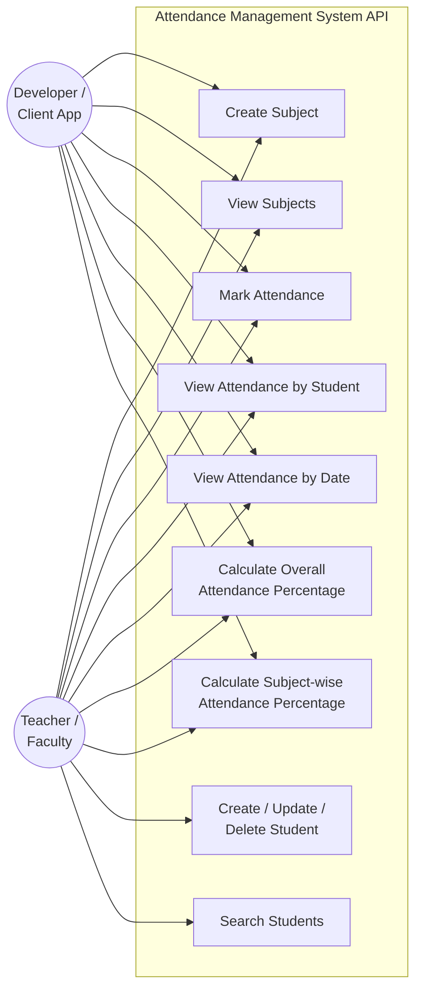

# Use Case Diagram

**Primary actor:** Teacher / Faculty (the person operating the API, e.g. via Postman or a
connected frontend)

**Secondary actor:** Developer / Integrator (a client application consuming the REST API)

## Use case descriptions

| Use Case | Precondition | Main Flow | Postcondition |
|---|---|---|---|
| Create Subject | Subject name/code not already used | Client submits subject name + code | New subject stored |
| Mark Attendance | Subject and student exist | Client submits the students, subject, date, status | Attendance row stored, duplicates rejected |
| View Attendance by Student | Student has attendance history | Client requests by student ID | List of attendance records returned |
| Calculate Attendance Percentage | At least one attendance record exists | Client requests percentage by student (and optionally subject) | Percentage value returned |
| Manage Students | — | Client creates/updates/deletes/searches student records | Student table reflects change |
