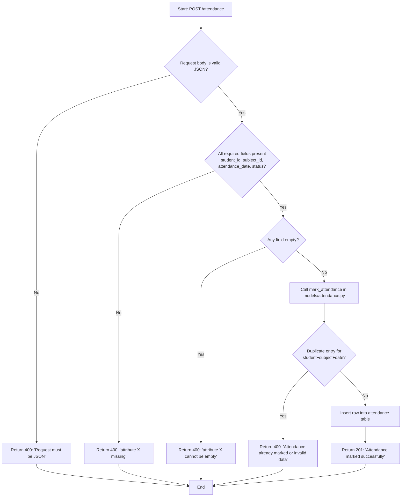
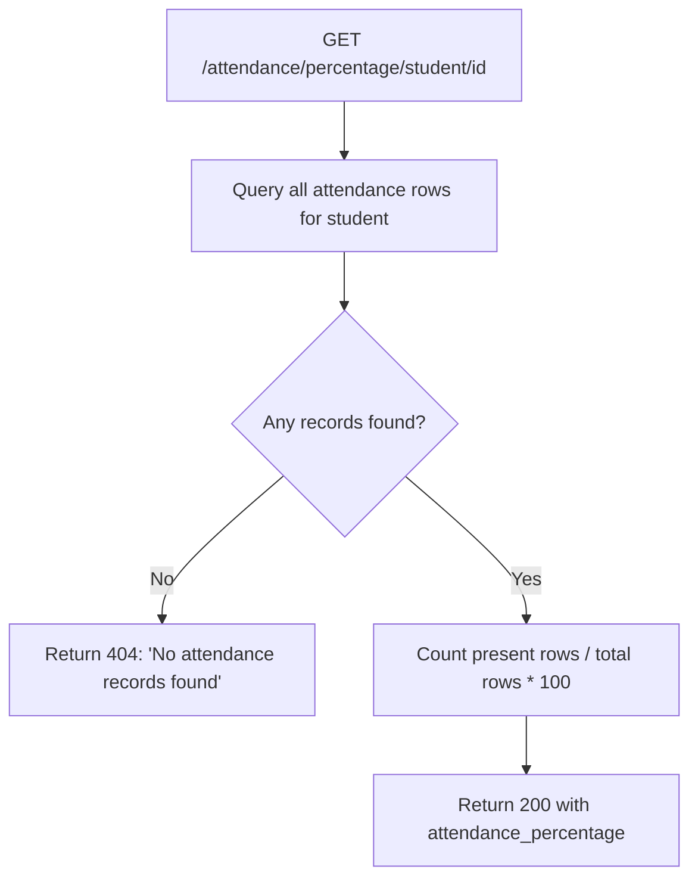

# Process Flow — Mark Attendance

This is the primary workflow of the system: a teacher/faculty member marking a student
present or absent for a subject on a given date.

## Related read/report flow — Attendance Percentage

