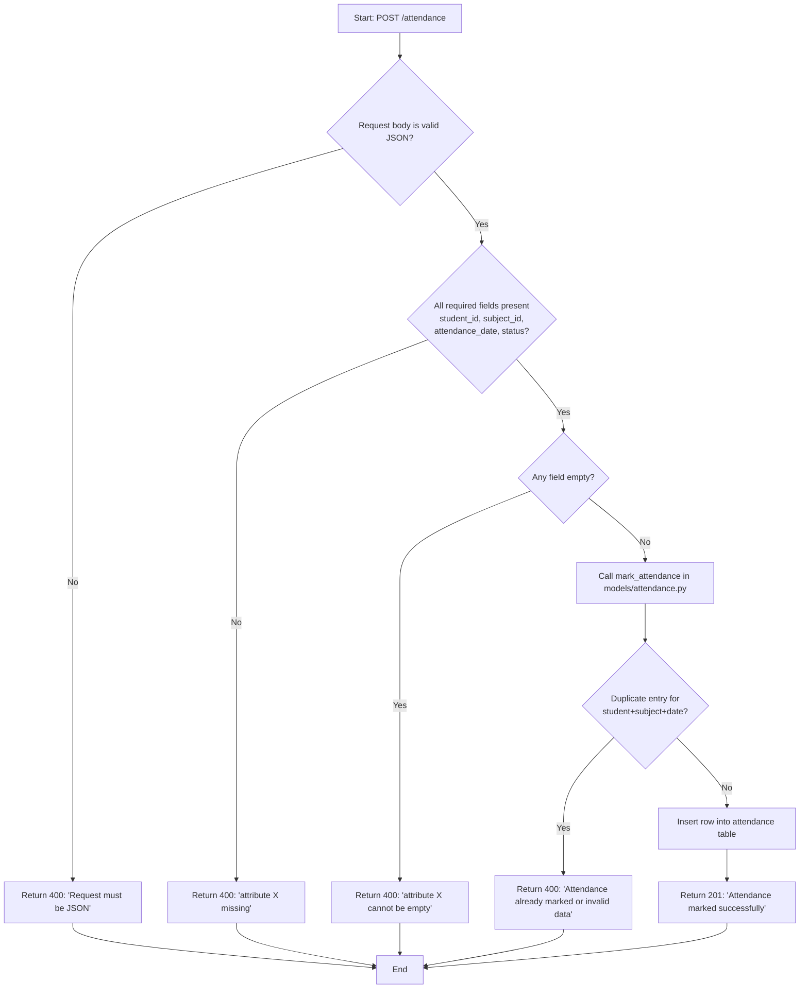
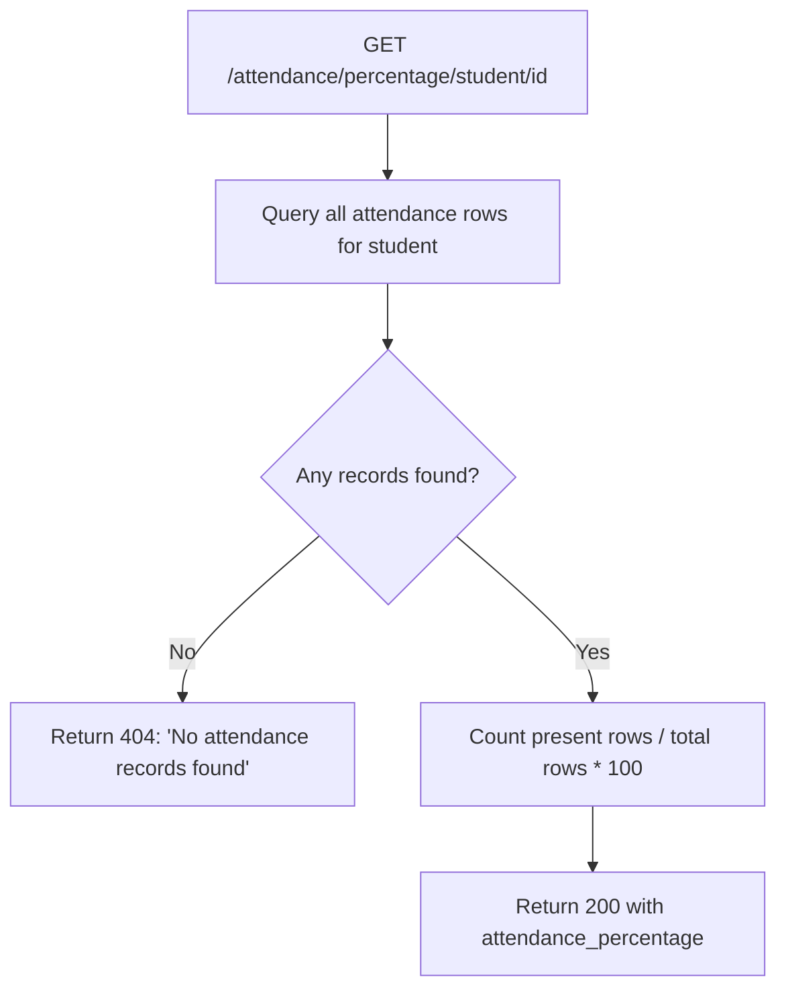

# Process Flow — Mark Attendance

This is the primary workflow of the system: for a teacher/faculty member marking a student
present or absent for a subject on a given date.

## Related read/report flow — Attendance Percentage

WORKFLOW

The Attendance Management System works by taking a request from the client and processing it through the Flask API before accessing the MySQL database.

1. The client sends a request
   Postman is used to send requests to the API. Depending on the task, the request can be related to a student, subject, or attendance record.

2. Flask receives the request
   The corresponding route receives the request. For example, student requests are handled by student_routes.py, subject requests by subject_routes.py, and attendance requests by attendance_routes.py.

3. Input is checked
   The route reads the JSON data sent by the client and checks the required fields. If required information is missing or empty the API returns an error response instead of sending incomplete data to the database.

4. Model function is called
   After the input passes the basic checks the route calls the related function from the model file. The model files contain the database-related operations.

5. Database operation
   The model connects to MySQL and performs the required operation. Depending on the request it can add, retrieve, update  or delete records.

6. Attendance checking
   When attendance is marked the system checks whether a matching attendance entry already exists. If it is already present the API returns a duplicate-entry response instead of adding the same record again.

7. Attendance percentage
   For percentage requests  the system reads the stored attendance records and counts the present and total entries. The percentage is calculated using the formula

Attendance Percentage = (Present Count / Total Count) × 100

The calculation can be performed for a student's overall attendance or for the particular subject.

8. Response is sent back
   After the database operation is completed, the result is returned to the Flask route. The route sends the final response in JSON format to the client.

